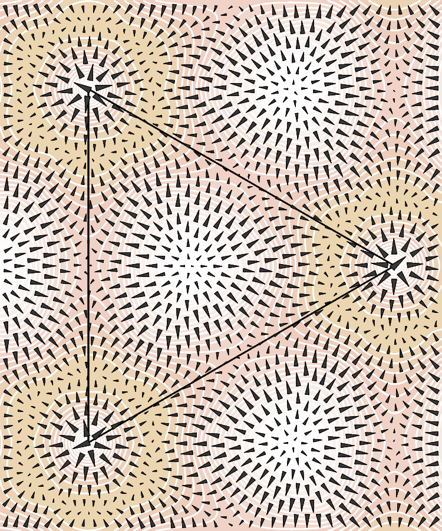

Lennard-Jones potenetial
------------------------

The (force induced by) the truncated Lennard-Jones potential
used in vfplot's ellipse placement.  The model has 3 discs
arranged into a triangle (a grocer's arrangement).

  

