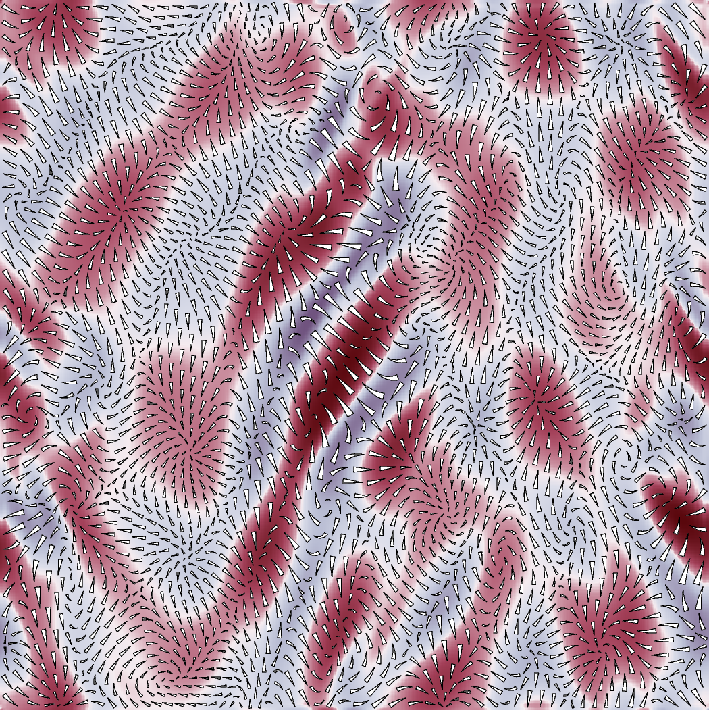

Magnetohydrodynamics
--------------------

Velocity field in a magnetohydrodynamics simulation illustrating
the suppression of turbulence by shearing, background is divergence,
data kindly provided by A. P. L. Newton (University of Sheffield).

  

